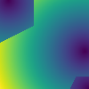
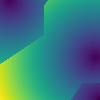
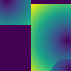

# GridGrowth

Basically a kind of cell automaton that grows cells around pre-defined kernels. Using only Numpy a cell is updated purely defined by its neighbour values. Once set the cell does not change its value. Imagine a grid/raster where most cells/pixels are NoData and the values of those with data push outwards. These kernels are grown against each other until all boundary conditions are met or if no more NoData cells/pixels exist.

## Why though?!

The initial idea was to model commerce catchment areas. A more attractive location will spread out farther than a less attractive location. This is why this method allows to use underlying terrain modifiers (speed up expansion on built-up areas, prevent expansion on water etc.), allow rules to transition between terrain types (Water to land only at harbours, Autobahn to other roads only at onramps etc.) and initial spread (like the immediate neighbourdhood will always be part of its closest kernel).

But really, all it does is make some NoData cells/pixels around severals kernels get assigned the value of one of the kernels.

## Quick Start

The most basic way to try it out is to pass a simple array to the main GridBuilder class and let it fill all the missing values. The following example will create an array from scratch, using 9999 as NoData values (if not explicitely stated, the class will use the mose prevalent value as the NoData value), initiating the class and iterating until all values are filled:

```
tarr = np.zeros((100,100), dtype="int") + 9999
tarr[0,9] = 2
tarr[57,95] = 3
tarr[99,99] = 2

myArray = GridBuilder(tarr)
myArray.iterate_forward()
```

Et voila, myArray should not contain any NoData values anymore. Btw, the "t" in tarr stands for "traverse", which is why you will find it often in the code as well.

## How it Works

Yeah sorry, it is still slow and I have to think about optimization. But to implement all these nice features like terrain dependency, I need to iterate over each cell/pixel at least twice to determine if its value is known yet.

Let's say there are two kernels: one has strengh 3, one has strenth 1. Now if a cell has NoData but its neighbouring cell has strength 3, it will also have strength 3 in the next run and be assimilated into the kernel that initiaed the strengh 3. Neighouring cells to the kernel with strength 1 are however only updated every 3rd iteration, because they are only 1/3 as strong. 

The modifiers (like terrain modifier or falloff) will alter these strenghts. If a NoData cell/pixel has several neighbour values that are eligible in the current iteration to assimilate this cell/pixel, the first value found will be used (= basically random determination).

Three terms are used to descrive traversing the grid:
* **Iteration**: each iteration represents one full traversal of each pixel in the grid
* **Step**: steps are incremented along Iterations, but reset to 1 once the maximum value is reached. In the above example with values 1 and 3, the step is returned to 1 every three iterations as all values had the chance to be set
* **Epoch**: each time Step is reset to 1, the Epoch is incremented by 1. The increment of Epoch as such means, how often the least strong value had the chance to be set. 

## Options & Keywords

The GridBuilder class has the following optional keywords you can use (you can substitute the following arrays with GeoTiffs if you are using GeoGridBuilder instead). 

* **t_ar** The array containing the kernels and their strengths. Must be Integer type. Corresponding arrays (cost_ar, terrain_ar) must have the exact same dimensions.

* **t_names_ar** is an array that initiates the names/ids of the kernels. If None, the original strength value of the kernel is used as its ID. If not given and two kernels with the same strength meet you will not be able to determine which was the seeding kernel later.

* **cost_ar** an array that has a value for all pixels that determines how "hard" it is to assimilate. Must be type INT. Higher values make the cell harder to assimilate. 

* **cost_method** 'add' (default) or 'multiply'. Determines how "cost_ar" is handled. "add" will add it to the values of t_arr, "multiply" will multiply them.

* **terrain_ar** an array that has coded terrain information. Only has an effect if a :terrain_rules_dict: is given as well

* **terrain_rules_dict** only has an effect if a :terrain_ar: is given. Values must be the same as in terrain_ar. Rules are read from:to ->
	- 'only_allowed':{2:7} means that from type 2 only a transition to type 7 is allowed an no other. Non specified transitions are considered allowed
	- 'limit_into' accepts a list of transition_to codes. All connections flowing INTO these codes will be set to 0 BUT can be overwritten by "only_allowed". Allows for bulk restriction of INTO rules.
	- 'takes_precedence' rules overwrite strength rules, if other cell would be stronger and fill central value 'takes_precedence' and 'only_allowed' can contain overlapping items
	- 'only_allowed', 'never_allowed' and 'takes_precedence' can have all have lists as items

	Example Dictionary:
	```
	terrain_rules_dict = {'only_allowed': {2:3, 1:0},
					'limit_into': [0],
					'never_allowed': {3: [2,1]},
					'takes_precedence': {0:1}}
	```

* **weight_ar** can be seen as a general directional effect. Must be a 3x3 array. Imagine as kind of a push factor, if all values in the 3x3 grid are 1 but the top left value is 5, then in all cases values coming from top left are over valued by a factor of 5. This can for example be used for modelling general "wind" effects.

* **weight_method** 'add' (default) or 'multiply'. Determines how "weight_ar is handled. "add" will add it to the values of t_arr, "multiply" will multiply them.

* **nan_value** manually set the value in t_ar that is to be treated as NoData. If None the most prevalent value is used

* **buffer_kernels_by** the number of cells around each kernel that are "reserved" by that kernel independent of other close by kernels

* **max_dist** maximum of cells/pixels each kernel is allowed to spread out

* **falloff_type** can be used to make the strength of a kernel diminish over distance. Distance if calculated as number of cells/pixels distance. Current supported falloff types are:
	- "linear": value - dist \* falloff_weight
	- "exp": value - dist ^ falloff_weight
	- "log": math.log(dist, falloff_weight)

* **falloff_weight** is used to calculate :falloff_type:. Can be float. If None:
	- "linear": 1
	- "exp": 2
	- "log": math.e

* **optimize_input** as the number of steps and as such iterations (full traversal over all cells/pixels) is determined by the maxium strength (including all modifiers) a large absolute value here will lead to "empty" iterations where no values are set. 
If :optimize_output" is true, the strength value are tried to be reduced by determining their greatest common divisor and dividing all kernel strengths by it. An initial kernel setup of (40,50,300) is as such reduced to (4,5,30). The :falloff_weight: is reduced by the same amount BUT only supported for linear falloff.


## Using GeoTiffs

As this was initially imagined with geodata in mind, I've added some support for GeoTiffs. To use this you MUST install Pythons GDAL bindings first (everything outside the GeoGridBuilder class will work perfectly fine without installing it). If you're using Anaconda, probably just use "conda install gdal" or try [conda-forge](https://anaconda.org/conda-forge/gdal). If you are on Windows and all else fails, all hail the mighty [Gohkle](https://www.lfd.uci.edu/~gohlke/pythonlibs/).

To use this instead of the basic array class, simply point your GeoTiffs to the GeoGridBuilder class. Let's say you have the array from the Quick Start section, but saved as a GeoTiff. Then simply do this:

```
myArray = GeoGridBuilder("C:/MySeriousWorkFolder/TotallyUsefulGeoData.gif")
myArray.iterate_forward()

myArray.save_to_geotiff("C:/OutputFolder/")
```

As you can see, it will also handle saving the array it uses internally to a georeferenced GeoTiff. Btw the support for GeoTiffs is hardcoded for now, to use other GDAL supported raster formats is surely not a problem but for now not supported.


## Usage & Examples

The following examples can be run self-contained by running examples.py

### SetUp of initial 100x100 arrays

|  |  |
|:--:|:--:|
| *[tarr] Barely visible init strength kernels with* | *[name_arr] Corresponding name arrays where kernels IDs are:* |
| (0,9)=2, (57,95)=3, (99,99)=2 | (0,9)=10, (57,95)=25, (99,99)=50 |

### Simple Cases

1) Load kernel strength array only and run in full without any additional. Name and strength array are the same\

	```
	grid = GridBuilder(tarr)
	grid.iterate_forward("full")
	```

	|  |  |  |
	|:--:|:--:|:--:|
	| *Fully grown strength array* | *Name array same as strength array* | *Distance array with distance from kernels* |

2) Load kernel strength array, run full but use different names/ids for kernels

	```
	grid = GridBuilder(tarr, t_names_ar=name_arr)
	grid.iterate_forward("full")
	```

	|  |  |  |
	|:--:|:--:|:--:|
	| *Fully grown strength array* | *Name array different from strength array* | *Distance array with distance from kernels* |

3) Load kernel strength array and different names array. Run only (arbitrary) 17 epoch

	```
	grid = GridBuilder(tarr, t_names_ar=name_arr)
	grid.iterate_forward("epoch", by_amount=17)
	```

	|  |  |  |
	|:--:|:--:|:--:|
	| *Strength array grown 17 epochs* | *Name array after 17 epochs* | *Distance array with distance from kernels* |